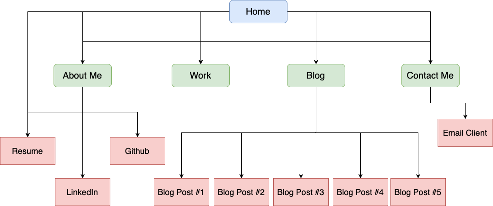

# T1A2 Portfolio Assignment

### Author:  Willem Gibson

[Published Portfolio Website](https://)

[Github Repository](https://github.com/)

[Presentation](https://youtu.be/)

## Purpose of Website

## Functionality / Features

## Sitemap

## Wireframes

Home Page

About Me Page

Work Page

Blog Page

Sample Blog Post

## Screenshots

**Please note that the background image will stay and cover the whole viewport with scrolling**:

### Home Page

Mobile:

Tablet:

Desktop:

### About Me Page

Mobile:

Tablet:

Desktop:

### Work Page

Mobile:

Tablet:

Desktop:

### Blog Page

Mobile:

Tablet:

Desktop:

### Sample Blog Post

Mobile:

Tablet:

Desktop:

## Target Audience

Employers and recruiters with sound IT knowledge, looking to hire a professional developer with a positive attitude and good technical skills. They are familiar with programming languages and software development.

## Tech Stack

* Wireframes and Sitemap: [draw.io](https://app.diagrams.net/)
* Website: Semantic HTML and CSS
* Deployment: [Netlify](https://www.netlify.com/)
* Slide deck: [Google Slides](https://docs.google.com/presentation/create/)