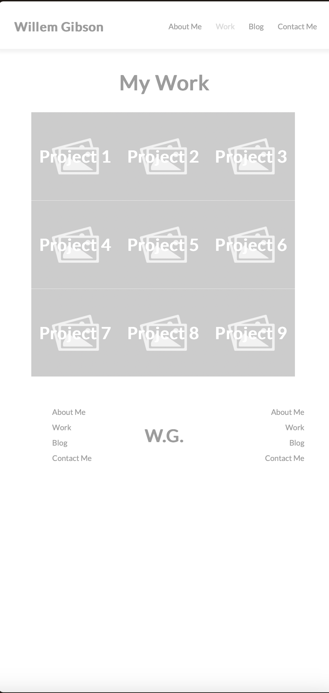

# T1A2 Portfolio Assignment

### Author:  Willem Gibson

[Published Portfolio Website](https://t1a2-portfolio.netlify.app)

[Github Repository](https://github.com/WillemGibson/T1A2_Portfolio)

[Presentation](https://www.loom.com/share/42abadca6df448dd82002d100abcc8f8?sid=6dde876e-4872-4630-8f8b-54852c65d2ca)

## Purpose of Website
The objective is not only to showcase my skills and capabilities but also to establish connections that could potentially pave the way for a meaningful career opportunity. By tailoring the content to resonate with the specific interests and needs of IT recruiters, I aim to position myself as a standout candidate in the competitive landscape of the technology sector. Thus this website will display these key details:

- My professional contact details
- A page detailing my skills, education, and experience
- A blog to get to know me as a person, learn what my hobbies are and my opinions about tech industry

## Functionality / Features
### Homepage
This page will act, just like most homepages, as a base to navigate through th entire webpage and will allow the user to progress throgh the pages.

Some features include:
- Flexbox Layout
- Quick information
- CSS animations
- Header/Footer
- Minimal Design
### About Me
This page will act as a more in-depth look at myself, my hobbies and most improtantly am expierience in the tech industry.

Some featues include:
- Flexbox layout
- Minimal Design
- Header/Footer
- Images & text
- Links to LinkedIn & Github

### Work
This page will act as a portfolio for my graphic design and developer work to show potential employers my skills through completed projects.

Some features include:
- CSS grid layout
- Minimal Design
- Header/Footer
- Project previews
- Links to Behance Project (Graphic Design)
- Links to Git repos (Developer)

### Blog
This page will act as a page to display previews of all the blog posts I've created and allow you view more on the blog Sample Page.

Some features include:
- Flexbox layout
- Minimal Design
- Header/Footer
- Images & text
- Previews of blog posts
- Learn more buttons that guide user to indivual blog pages

### Blog Sample
This page will act as a page to display all the blog posts in full detail.

Some features include:
- Flexbox layout
- Minimal Design
- Header/Footer
- Images & text
- Back buttons that sent you to previous page

### Contact Me
This page acts as a hub for all my professional contact details.

Some features include:
- Flexbox layout
- Minimal Design
- Header/Footer
- Images & text
- Html form
- Submit button that opens email client and copies over input data

## Target Audience
The main target audience for this project is IT recruiters and professionals to see and help me break into the industry with a career oppotunity.

## Tech Stack

* Wireframes and Sitemap: [draw.io](https://app.diagrams.net/)
* Website: Semantic HTML and CSS
* Deployment: [Netlify](https://www.netlify.com/)
* Slide deck: [Google Slides](https://docs.google.com/presentation/create/)

## Sitemap

## Wireframes

Home Page

About Me Page

Work Page

Blog Page

Sample Blog Post

## Screenshots

### Home Page

Mobile:

Tablet:

Desktop:

### About Me Page

Mobile:

Tablet:

Desktop:

### Work Page

Mobile:

Tablet:

Desktop:

### Blog Page

Mobile:

Tablet:

Desktop:

### Sample Blog Post

Mobile:

Tablet:

Desktop:

### Contact Me Page

Mobile:

Tablet:

Desktop:
